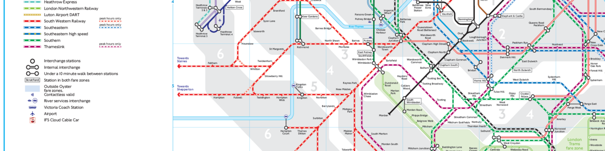
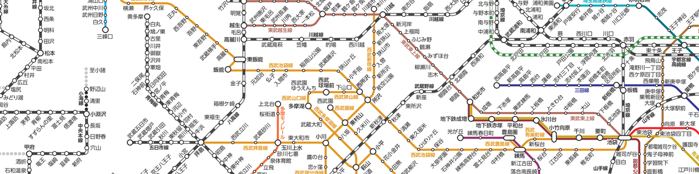

### 你好 👋

- 🎓 I’m an MSc candidate in **Software Systems Engineering** at **UCL**, graduating in **September 2025**.  
  Right now I’m interning at **Cisco** on the *Visual Inspection Tool* project, building a Qt-based video player and rendering pipeline.
- 🌱 Currently leveling-up on **video processing**, **LLM applications**, and **large-scale data engineering**.
- 📫 Reach me at **zhangboningjack@gmail.com**.
- 🏅 ICPC medalist, open-source enthusiast, and life-long learner.

---

  

  

  

- London Rail & Tube Services Map © Transport for London & Rail Delivery Group — personal use only（<!--MAP_UPDATE_DATE_EN-->2026-02-08<!--/MAP_UPDATE_DATE_EN-->）  
- 北京地铁线路图 © 北京京港地铁有限公司 — 仅供个人学习使用（<!--MAP_UPDATE_DATE_CN-->2026年2月8日<!--/MAP_UPDATE_DATE_CN-->）  
- PASMO・Suica路線図（首都圏エリア）© 株式会社パスモ 2025年4月1日 — 個人利用のみ可（<!--MAP_UPDATE_DATE_JP-->令和8年2月8日<!--/MAP_UPDATE_DATE_JP-->）

