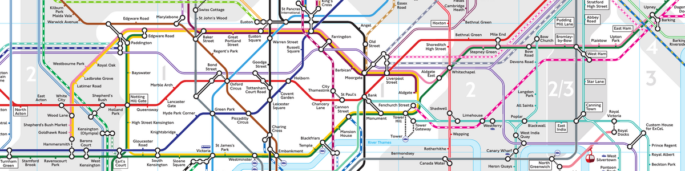
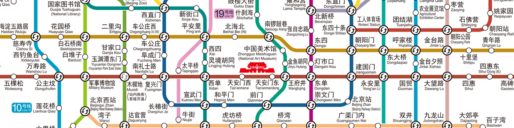
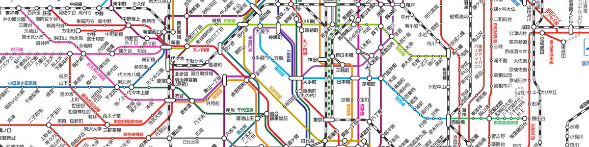

### 你好 👋

- 💻 I’m a developer at **Alibaba**.
- 🎓 I graduated from **UCL** with an MSc in **Software Systems Engineering**.
- 🌱 Currently leveling-up on **video processing**, **LLM applications**, and **large-scale data engineering**.
- 📫 Reach me at **zhangboningjack@gmail.com**.
- 🏅 ICPC medalist, open-source enthusiast, and life-long learner.

---

  

  

  

- London Rail & Tube Services Map © Transport for London & Rail Delivery Group — personal use only; last fetched（<!--MAP_UPDATE_DATE_EN-->2026-10-10<!--/MAP_UPDATE_DATE_EN-->）  
- 北京地铁线路图 © 北京京港地铁有限公司 — 仅供个人学习使用；最近获取（<!--MAP_UPDATE_DATE_CN-->2026年10月10日<!--/MAP_UPDATE_DATE_CN-->）  
- PASMO・Suica路線図（首都圏エリア）© 株式会社パスモ — 個人利用のみ可；最終取得（<!--MAP_UPDATE_DATE_JP-->令和8年10月10日<!--/MAP_UPDATE_DATE_JP-->）

